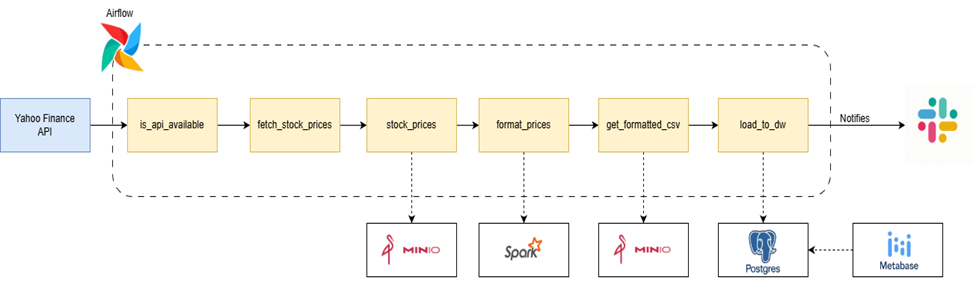
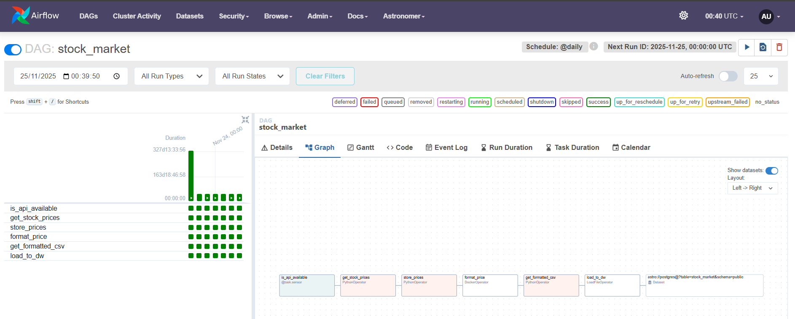

# ETL Apple Market

Welcome to the **ETL Apple Market Project**!

# Pipeline Overview

The Apple Market ETL Pipeline performs the following steps:

1. **API Availability Check**  
   The pipeline begins with an Airflow Sensor that continuously checks if the Yahoo Finance API is reachable.  
   This ensures the ETL does not start until the data source is ready.

2. **Extract Stock Prices**  
   Once the API is available, a Python task fetches Apple's historical price data.  
   Raw JSON data is then uploaded to **MinIO**, acting as S3-compatible object storage.

3. **Transform with Apache Spark**  
   A Spark job (triggered via DockerOperator) processes the raw JSON:

   - Cleans and normalizes the schema
   - Converts timestamps
   - Produces a clean, analysis-ready CSV

   The transformed CSV file is saved back into MinIO.

4. **Load to Postgres (Data Warehouse)**  
   The cleaned CSV is retrieved from MinIO and loaded into **Postgres** using the Astro SDK.  
   This database acts as the final data warehouse for analytics.

5. **Dashboarding with Metabase**  
   Metabase connects directly to Postgres, enabling:

   - Daily closing-price trends
   - Trading volume charts
   - Average price and volume metrics
   - Custom dashboards for Apple stock performance

6. **Notifications via Slack**  
   Once the pipeline completes successfully, Airflow triggers a Slack Notifier to send an automated success alert.

# Airflow DAG Graph – ETL Apple Market Pipeline

# Dashboard

